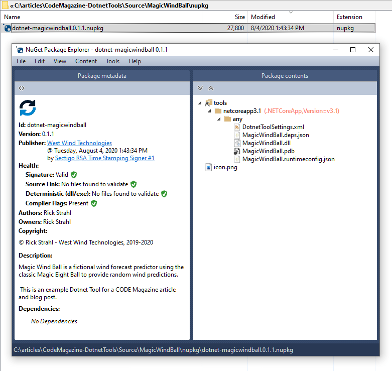
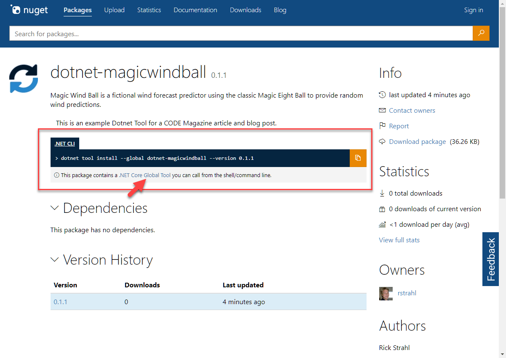
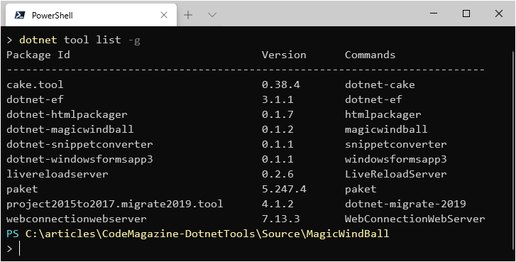
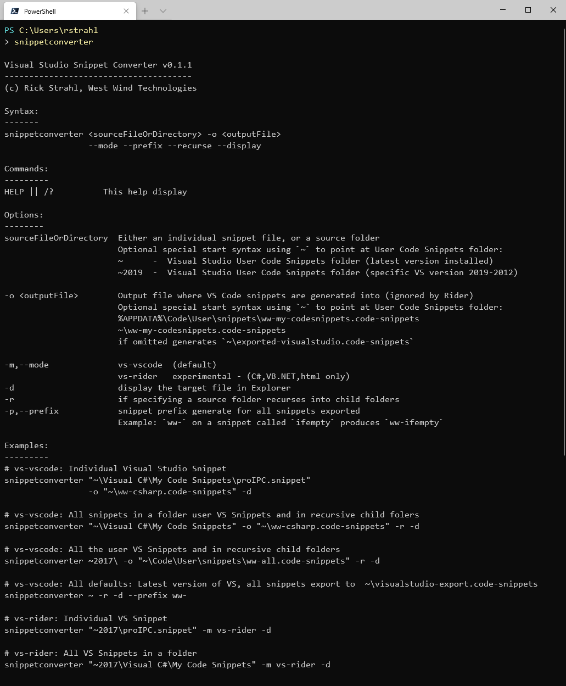
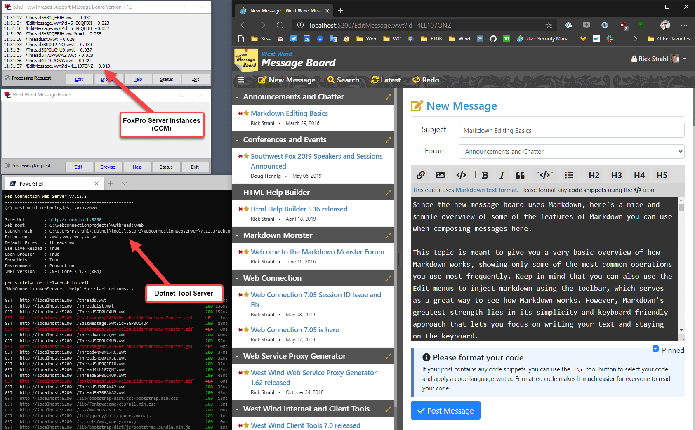

# Using .NET Core Tools to Create Reusable and Shareable Tools & Apps

Starting with .NET Core 2.1 Microsoft introduced the **Dotnet Tools** platform as part of the .NET Core SDK and since then these tools have become a vital, although underutilized part of the .NET eco system.

Dotnet Tools are a simple way to create, publish and consume what are essentially .NET Core applications that can be published and shared using the existing NuGet infrastructure for packaging and distribution. This means it's really quick and easy to build tools that you can share either publicly with the world or privately with yourself or your onsite team.

## What is a Dotnet Tool?
When you break down a Dotnet Tool it boils down to its simplest terms you end up with this simple statement:

> **“A Dotnet Tool is a glorified.NET Core Application that can be quickly and easily shared and installed via NuGet.”**
>
> <small>*me, 2020*</small>

The idea behind a Dotnet Tool is to make it easy to build, publish and consume executable tools in the same way you've been able create NuGet packages for .NET and .NET Core components.

And while the original idea was to build tools to aid as part of the build and development process, this platform really offers a much wider scope because **you can publish and share any .NET Core executable application**. This includes servers that run full ASP.NET Core applications or services, and even .NET Core desktop applications.

### Why use Dotnet Tools?
While the idea behind Dotnet Tools isn't anything new, this tooling does provide a number of benefits to developers and the entire .NET Core eco system. The big selling points are:

**Easy to use**
* Single command install. Example: `dotnet tool install -g LiveReloadServer`
* Global path access to run command: `LiveReloadServer --help`

**Easy to build**

* Uses standard .NET Core Projects
* Uses existing NuGet Infrastructure
* Nothing new to learn - works with existing tech
* Configured via standard `.csproj` settings

**Sharing**

* Can be easily shared
* Can reach a large number of users via NuGet
* Quickly published and available 
* No explicit package validation

**Community**

* Ease of use and shareability promotes creation of tools
* Shared content helps build community

On the flip side there is a big prerequisite to using a Dotnet Tool:

* The **.NET Core SDK is required** to install a Dotnet Tool

The SDK dependence is both a blessing and a curse: Because the .NET Core Runtime guaranteed to be installed, binaries of your Dotnet Tool can be very small and only consist of application specific files. But the .NET SDK has to exist on the target machine and this SDK install is neither small, nor something that a typical, non development user will already have installed.

### Global and Local Dotnet Tools
Dotnet Tools can be installed either as a **global** or **local** tool. Global tools are easily accessible on the entire machine in a central and path mapped location. Local tools are installed into a specific subfolder and only accessible from there. The latter is useful for build systems that need to encapsulate tools as part of a build process or Continuous Integration (CI).

In this article I focuson the usage for **global tools** and the sharing aspects of Dotnet Tools as general purpose utilities using the global `-g` command line switch. But everything except the install location also applies to local tools - minus the `-g` command line switch in the examples.

### Careful: Security of Dotnet Tools
Since Dotnet Tools are executables that are installed from a remote source and since there is no validation process for published tools, it's important to understand that **there is a potential security risk** to your machine. The code that comes down can execute locally on your system and has access to your local resources when you run the tool.
  
Be sure you:

* Trust the publisher of the tool
* The tool has reviewable source code available in a repository
* Check for issues on the repository

**Be careful and know the risks!**

To be fair, the same cautions apply to NuGet packages since those too can execute any code contained in the package and there's not much concern around that.

### There's nothing new under the Sun!

> ***“Did you just describe NPM?”***  
> Yup: Dotnet Tool is very much like NPM  for .NET Core.

If all this looks familiar from NodeJs and NPM - you're right. The idea of shared tools is not new by any means and follows various other development platforms and their package managers. But for .NET to easily publish and share binary executable tools in a cross-platform manner is relatively new and opens up the reach of small and useful tools that otherwise would never be shared. 

### What can you use Dotnet Tools For?
Although Dotnet Tools were initially designed to provide development time helper tools, they are just plain .NET Core executables that can do anything that a .NET Core executable can do. This means you can use it for all sorts of things that might not be directly developer related.

Here are a few general use cases addressed by Dotnet Tools:

* **Build and Dev Time Tools**  
There are many tools that follow the original design goal for creating project helpers that make development tasks easier or facilitate external but related development operations. For example, tools like EF migration commands in `dotnet ef`, `dotnet watch run`, and the user secrets manager, dotnet watch are all Dotnet Tools that fit this bill. There are many tools available in this category.

* **Generic Command Line Tools**  
If you need to build some complex command line helpers that work on scenarios that are more complex than what you reasonably want to do in PowerShell or Bash, a tool can fit that niche nicely. Because these tools can be shared and installed easily and are generally very small they make a good fit for *'beyond scripting'* scenarios.

* **Local Servers**  
.NET Core makes it easy to build server applications and it's easy to create self-contained Web Server or Services applications. Whether it's running a Web application locally for testing, or whether you have some internal application that maybe is a hybrid that uses both a Web interface and a desktop application in mixed mode, a Dotnet Tool makes it easy to provide this. It's very powerful to be able to create **small** and easily shareable, self-contained Web and server applications. I'll show a couple of examples of this later.

* **Desktop Applications**  
Although Microsoft's official documentation claims that `Dotnet Tool` is meant for Console Applications, it turns out that you **can** also create desktop applications and share them as a tool. You can create .NET Core WinForms and WPF applications and package them as tools too. Keep in mind though that WinForms and WPF applications are platform dependent and have to run on Windows, unlike pure Console applications which can run on any supported .NET Core platform assuming they are not using platform specific features.

### Locating Dotnet Tools Available
One of the reasons that Dotnet Tools are not so widely used that it's not that easy to find them. Until very recently you weren't even able to search the [NuGet Site](https://nuget.org) specifically for tools but that was recently fixed with new search filters.

There are a couple of other places you can check for tools:

* Nate McMaster has a GitHub repo with a [list of many Dotnet Tools](https://github.com/natemcmaster/dotnet-tools)

* The [ToolGet Site](https://www.toolget.net/tools?q=LiveReloadServer) searches NuGet with a Dotnet Tool filter!

### Dotnet Tool or Platform Specific Binary?
.NET Core supports creating executable binaries for every platform that it supports. But each platform requires a custom executable launcher and runtime dependencies to run, which means each platform distribution is different. It takes quite a bit of extra effort to create these separate build targets and distribute each one.

It's possible to create standalone executables for each platform using either a pre-installed .NET Core runtime installation, or a fully self-contained executable that can contain all the required runtime files in addition to the files that your application needs to run. Self-contained applications are great for self-reliance and predictable behavior, but they are terribly large as the .NET Core base runtimes make up a minimum of 70mb of distribution size.

A full self-contained application is useful and sometimes required. If you're building an end user tool or application, then a self-contained application that has everything it needs included is usually a  better call. But if you're building developer tools the light weight and universal `Dotnet Tool` distribution experience is often preferable.

The advantage of building a Dotnet Tool is that it's **not platform specific**. Like a NuGet component , a Dotnet Tool is distributed as a NuGet package which contains only the compiled .NET assemblies. There is no 'launching' executable packaged. Since Dotnet Tools rely on an SDK installation to run, the runtime is guaranteed to be there. If `dotnet tool` can run on the machine, so can your Dotnet Tool.

This means you can build a single, relatively small NuGet package as a Dotnet Tool and it will work on all supported .NET Core platforms, assuming your code is written to otherwise use platform agnostic features. That's cool: Dotnet Tool provides you cross platform functionality without having to build and maintain multiple platform specific loaders and it keeps the deployment size very small. 

## Creating and using Dotnet Tools
Enough abstract talk, so let's jump in and see how you can:

* Build a Dotnet Tool package for distribution
* Publish a Dotnet Tool package
* Consume a Dotnet Tool package

### Create a Dotnet Tool Step by Step
Let's create a very simple project `MagicWindBall` that 'predicts' wind conditions for the day. It's a play on words of Magic Eightball, which is a fake fortune telling device and I'm highjacking the idea to tell me my wind fortunes. 

Start by creating a .NET Core Console project. I'll use the `dotnet` Command line tooling, but you can also use Visual Studio (or Rider etc.) to create a new **.NET Core Console project**.

From the command line, start by creating a new folder with the Project name, and then create a project in that folder:

```ps
mkdir MagicWindBall
cd MagicWindBall
dotnet new console
code .
```

This creates a new project `MagicWindBall.csproj` which you can open in Visual Studio or Visual Studio Code. I'll use VS Code here as shown in **Figure 1**, which makes it easy to open the projects from a folder via `code .`.

  
<small>**Figure 1** - Opening and running the Console project in Visual Studio Code</small>

This project is very simple, with an imaginary wind forecast generator that randomly displays a string from a list of pre-defined wind condition strings.

The code is along these lines: <small>(full code on GitHub at https://github.com/RickStrahl/CodeMagazine-DotnetTools/blob/master/Source/MagicWindBall/Program.cs)</small>

```cs
static void Main(string[] args)
{
    WriteWrappedHeader("Magic WindBall");

    Console.WriteLine();

    Write("thinking.", ConsoleColor.Cyan);
    Wait(500);
   
    Write(" consulting the stars.", ConsoleColor.Yellow);
    Wait(1000);
    Write(".", ConsoleColor.Yellow);
   
    Write(" guessing some more.", ConsoleColor.Cyan);
    Wait(1000);
    Write(".", ConsoleColor.Cyan);
    
    Console.WriteLine('\n');

    var rnd = new Random(DateTime.UtcNow.Millisecond);
    var val = rnd.Next(6);
    
    Console.WriteLine("Wind today be:");

    switch (val)
    {

        case 0:
            WriteLine("No Wind - Skunked again.", ConsoleColor.DarkYellow);
            break;
        case 1:
            WriteLine("Light Wind - Take a nap, pray for wind.", ConsoleColor.DarkCyan);
            break;
        case 2:
            WriteLine("Light Breeze - Sucker wind.", ConsoleColor.DarkGreen);
            break;
        case 3:
            WriteLine("Breezy- Wake up and get ready.", ConsoleColor.Green);
            break;
        case 4:
            WriteLine("Windy- What the hell are you doing at the keyboard?", ConsoleColor.Yellow);
            break;
        case 5:
            WriteLine("Super Nuker- Get out and rig your Hankie.", ConsoleColor.Red);
            break;
        default:
            WriteLine("Roll the Dice - It's coming in waves.");
            break;
    }

    Console.WriteLine();
}
```

First, let's make sure the code works as a regular Console application. Open a Terminal in the project folder and do:

```ps
dotnet run
```

In **Figure 1** I use the built-in Terminal in VS Code Terminal to test the 'application'.

#### Make it a Dotnet Tool
You now have a plain .NET Core Console application. To turn this into a **Dotnet Tool** add a few specific settings to the project file. At minimum add:

```xml
<Project Sdk="Microsoft.NET.Sdk">

  <PropertyGroup>    
    <OutputType>Exe</OutputType>
    <TargetFramework>netcoreapp3.1</TargetFramework>
  </PropertyGroup>

  <!-- Dotnet Tool Specific settings -->
  <PropertyGroup>
    <PackAsTool>true</PackAsTool>
    <PackageId>dotnet-magicwindball</PackageId>
    <ToolCommandName>magicwindball</ToolCommandName>
    
    <PackageOutputPath>./nupkg</PackageOutputPath>
    <GeneratePackageOnBuild>true</GeneratePackageOnBuild>
  </PropertyGroup>

</Project>
```

The Dotnet Tool specific settings set the project as a .NET tool via `<PackAsTool>`, provide a name and set up the project to build as a NuGet package. With these flags in place you can now build the project and generate the Dotnet Tool NuGet Package into the `./nupkg` folder:

```ps
dotnet build -c Release
```

If you use Visual Studio just build in **Release** mode.

This builds the project **and creates a NuGet Package** in the `./nupkg` folder. You can use the [NuGet Package Explorer](https://github.com/NuGetPackageExplorer/NuGetPackageExplorer) to spy into the package to see what is in the package as shown in **Figure 2**.

  
<small>**Figure 2** - The Dotnet Tool NuGet Package in the NuGet Package Explorer
</small>


#### Testing the Dotnet Tool Locally
Once you've created the NuGet Package you'll probably want to test it locally first before publishing it to NuGet (if at all). You can do that by installing the Dotnet Tool locally from a folder. To install you use `dotnet tool install` or `dotnet tool update`.

For public tools that come from the default, cloud based NuGet package store you use:

```ps
Dotnet Tool install -g dotnet-magicwindball
```

But... this doesn't work yet, because I haven't published the package yet. You can however test the package locally by installing the NuGet component from a folder by specifying the `--add-source ./nupkg` command line option:

 ```ps
 dotnet tool install -g dotnet-magicwindball --add-source ./nupkg
 ```

Et voila! You've just installed the Dotnet Tool locally and you can now run the tool simply by typing `magicwindball` into the Terminal from anywhere on your machine. **Figure 3** shows building, installing and running the tool in a Terminal window.


<small>**Figure 3** - Build and run your Dotnet Tool locally</small>

#### Publishing to NuGet
Dotnet Tools are published as NuGet packages and use the same exact mechanism you use to publish a NuGet package for a .NET Component. You use `Nuget publish` or you can also use the NuGet Package Explorer shown earlier in **Figure 2**. 

Here's a build, sign and publish PowerShell script <small>([full script on Github](https://github.com/RickStrahl/CodeMagazine-DotnetTools/blob/master/Source/MagicWindBall/publish-nuget.ps1))</small>:

```ps
dotnet build -c Release

$filename = gci "./nupkg/*.nupkg" | `
                sort LastWriteTime | `
                select -last 1 | `
                select -ExpandProperty "Name"
$len = $filename.length

if ($len -gt 0) {
    nuget sign  ".\nupkg\$filename"   `
          -CertificateSubject "West Wind Technologies" `
          -timestamper " http://timestamp.comodoca.com"

    nuget push  ".\nupkg\$filename" -source nuget.org
}
```

Note that NuGet Package signing is optional, but since I already have a publisher certificate I'm using it to sign my package. For the `nuget push` to work you'll need to set the active NuGet publishing Id before you publish the package.

```ps
nuget setApiKey <your_API_key>   
```

Once published the package is listed on NuGet after a few minutes. **Figure 4** shows what the package looks like on the NuGet Package Store site.

  
<small>**Figure 4** - The published Dotnet Tool in the NuGet Package Store</small>

Once published, the package becomes accessible within a few minutes. Feed listings can take a bit longer, so you may have to explicitly specify a version on the command line using the `--version` flag.

You can now install and run the component from the NuGet Package Store. **Figure 5** shows the install and run sequence.


<small>**Figure 5** - Install and Run a Dotnet Tool</small>

If you need to update the Dotnet Tool, make your code changes and increment the version number of the project then simply, re-publish to NuGet. A new package with the new version number is created and pushed and that becomes available on Nuget. Then use `dotnet tool update -g dotnet-magicwindball` to update the local tool installation. 

### How a Tool gets Executed
Dotnet Tools are deployed as .NET NuGet packages which **don't include an OS specific executable file**. Rather, when a tool is installed, a platform specific, native launcher executable is generated that acts as a proxy launcher for the .NET Core runtime, which then bootstraps the Dotnet Tool entry assembly. The launcher is created in a system mapped `.dotnet` folder and is then globally available using the `<CommandName>` specified by the project. **Figure 6** shows the launcher in the `.dotnet` root folder and the actual install folder that holds only the .NET assemblies that execute on any platform.


<small>**Figure 6** - An installed Dotnet Tool uses a proxy executable to launch the Dotnet Tool.</small>

The `.dotnet/.store` path holds the actual unpacked NuGet package content for each tool installed. When you run the launcher (`magicwindball.exe` on Windows), it loads the .NET Core runtime and then calls the `static void Main()` entry point in the entry assembly of the package. The `.exe` you see on the left in **Figure 6** is only a stub launcher. If you hook up an IL decompiler to the EXE as I've done in **Figure 6** with Reflector, you'll find that the exe is a **native binary**, not a .NET assembly. 

### Running on another Platform: Linux with WSL and Mac
Dotnet Tools are platform agnostic and assuming your application doesn't use any platform specific features, they can run as is on Windows, Mac or Linux.

So let's run this Dotnet Tool on Linux using WSL using the same steps as before. Use `dotnet tool install` and then execute the command. **Figure 7** shows what that looks like inside of the Windows Subsystem for Linux (WSL). If you have WSL installed on Windows or if you have another Linux or Mac OS available to test on, bring up a terminal there and follow the same procedure we used on Windows to install as shown in **Figure 7**.

  
**Figure 7** - Dotnet Tools are cross platform, here running under Linux in WSL

It also works on a Mac as shown in **Figure 8**.

  
**Figure 8** - Dotnet Tools are cross platform, here running under Linux in WSL

It all works on supported platforms as long as your application doesn't do anything that is platform specific.

### Listing and Managing Installed Tools
You can check what tools you have installed by using the `dotnet tool list -g` command as shown in **Figure 9**.

  
**Figure 9** - Listing installed Dotnet Tool components

This lists both the **Package Id** which is the install name used with NuGet and the **Command** name which is used to run the package. Package Id and Command can be different as demonstrated by the `dotnet-magicwindball` id and the `magicwindball` command. But they don't have to be different. The `dotnet-` prefix is an original convention used by various .NET internal tools to make it obvious they are .NET tools, but that convention is actually discouraged now. Generally it's better to use the same name for the package id and command.

> Keep in mind that tool command names are **case sensitive** on case sensitive operating systems.

You can keep tools up to date using the `update` command:

```ps
dotnet tool update -g dotnet-magicwindball
```

You can easily uninstall tools with `uninstall`:

```ps
dotnet tool uninstall -g dotnet-magicwindball
```

## Example Components
To bring home the utility of dotnet tools, I'd like to describe a few of the Dotnet Tools I've created and discuss the how's and why's of creating them. I've been huge fan of these tools because it is so frictionless to publish a tool for easy reuse. If it wasn't for the easy of sharing via NuGet I probably wouldn't have bothered sharing these tools at all.

Some of these tools I built mainly for myself, but since I've made them public they ended up getting used by quite a few other people. Maybe you'll find some of these useful as well. But more importantly I hope it inspires you to share your own tools no matter how silly or simple - somebody might find them useful too!

### Simple Tools 
The first couple of examples are your typical utility tools that under normal circumstances I would have distributed as a downloadable installer or just a standalone binary. If a tool is popular enough I still go that route **in addition to the Dotnet Tool**, but for me personally I tend to use the .NET tool rather than a standalone installed application.

#### Visual Studio Snippet Converter
https://tinyurl.com/yxnnw2hf

This tool is a small utility to convert Visual Studio Code Snippets (code expansions) to other development environments. It supports:

* Visual Studio Code Snippets
* JetBrains Rider Snippets

This tool is directly targeted at developers who are already using Visual Studio and so are **very likely** to have the .NET SDK installed just by virtue of using Visual Studio. So as a tool this is perfect and it fits the **Dotnet Project Tooling** use case that was the original design goal by Microsoft.

The background behind this tool is that I have a ton of Visual Studio code snippets that help me quickly format blocks of code - from inserting properties, creating entire blocks of classes that have complex signatures or inserting complex HTML markup completions for various Web frameworks.  Snippets are an incredibly useful and very underutilized feature in various IDEs.

Today I use a number of different development tools: Visual Studio, VS Code, Rider in particular and sharing snippets across them is much easier than recreating them in each environment.

So this tool lets me export my Visual Studio snippets into VS Code and Rider. It also provides me a with a 'master' snippet repository in Visual Studio that allows me to update snippets there and then easily update the snippets in the other environments with the Dotnet Tool.

To use this tool:

```ps
Dotnet Tool install -g snippetconverter
```

For options just run it and it shows the options as shown in **Figure 10** which illustrates the functionality best.

  
<small>**Figure 10** - A Snippet Converter tool to convert Visual Studio Snippets to VS Code and Rider</small>

To run the converter you can specify a source snippet or folder and an output path:

```powershell
snippetconverter "~\Visual C#\My Code Snippets" `
           -o "~\ww-csharp.code-snippets" `
           -m vs-vscode -r -d
```

To make the snippet location easier to use the tool lets you use `~` for the default snippet folders for each IDE. For Visual Studio this points to the `<Documents>\Visual Studio 2019 Code Snippets` folder for example.

**Figure 11** shows the source snippet folder and output generated by the Visual Studio code export:

  
<small>**Figure 11** - Migrated code snippets from the Snippet Converter in VS Code</small>

#### HtmlPackager
https://tinyurl.com/y3hgmq7l

HtmlPackager is a tool to package an HTML URL into a fully self-contained 'package' or folder bringing all the content offline so it can be viewed viewed completely offline. It's similar to **Save as...** in a Web Browser, but you can automate the process. This is useful for attaching to emails, or for archival purposes.

This tool came about because I needed this functionality at the time for my Markdown Monster (https://markdonwmonster.west-wind.com) editor. I looked around for a command line tool, but came up with nothing that worked that had a small footprint and no dependencies. As a result I ended up building my own .NET library that I used in Markdown Monster initially, but then also built into a Dotnet Tool so it can be used from the command line and automated.

This tool is a general purpose tool and `dotnet tool` functionality just provides a very easy way to publish and share this tool.

The `dotnet-htmlpackager` tool can be installed with:

```ps
dotnet tool install -g dotnet-htmlpackager
```

Once installed you can run using the `help` command to see the command line options. To capture a URL uses a command like this:

```ps
htmlpackager  https://markdownmonster.west-wind.com
          -o /temp/captured/MarkdownMonster.html -v 
```

which creates a single, very large but fully self-contained HTML file:

  
<small>**Figure 12** - Running HTML Packager against a URL produces a single self-contained HTML file</small>

There are other options for creating:

* A folder of loose HTML and resource files (`-x`)
* A zip file of the folder of loose HTML and resources (`-z`)

### Servers
A .NET tool is just a .NET Core application, so you can take advantage of just about any .NET Core feature including the ability to create self-contained Web server applications and services that you can run locally.

#### LiveReloadServer: A Generic Static File Web Server 
https://tinyurl.com/yyz8fle3

I frequently run local static Web sites on my development machine for quickly running a SPA application, working on static Web site content or one of my many standalone JavaScript library projects.

I could spin up a full development environment like Visual Studio and IIS Express, or use something like WebPack to provide infrastructure for hosting and running, but that but that feels like overkill of many of the simple run and edit scenarios I have. As an alternative using the `LiveReloadServer` I can quickly run a local development server and 'just run' a local folder as a Web site. It's a small, self-contained .NET Core based static Web Server that can serve local static file content out of an arbitrary folder you specify. This server can:

* Serve Local Static Web Content
* Loose Razor Pages (optional)
* Markdown Pages (optional)

In addition it also provides what for me is the most useful feature:

* Live Reload of changed content (optional)

The live reload functionality is built-in and enabled by default and automatically refreshes any active HTML pages loaded through the server when an HTML page or any other related resources like CSS, JavaScript are changed. This makes it a great, generic tool to use on older non-build process Web sites or tools you might need to run locally to add functionality and make changes.

As a Dotnet Tool it's easy to install the server and it's very quick to run and start up.

A standalone local Web server is not a new idea as there have been static NodeJs based servers like http-server (https://github.com/http-party/http-server) or browser-sync (https://www.browsersync.io/) forever, but these tools require NodeJs and the standalone live reload tools like BrowserSync I've used don't work very reliably. LiveReloadServer is an alternative and it addresses all these scenarios nicely.

To use Live Reload Server:

```ps
dotnet tool install -g LiveReloadServer
```

To run it you simply point it at a `--WebRoot` folder on your local machine and that folder then becomes the content source for the Web Site.

  
<small>**Figure 13** - LiveReloadServer generically serving Web content out of a local folder</small>

The Live Reload functionality is enabled by default so you can edit static text files and immediately see the changes reflected in active browser pages. If you have Razor Pages and/or Markdown Page processing enabled you can also edit Razor and Markdown pages and see those pages refreshed immediately as well.

Because LiveReloadServer is a Dotnet Tool it also works great on a Mac and Linux even though I originally built it for my local Windows setup. With some very minor adjustments for pathing on Mac and Linux the server also works on those platforms.

By default the server runs as a local machine Web server, but it can also expose an external port, so it can also be used to host externally accessible sites. This is great for giving network access to other users on your internal network, or for applications that need expose Web server functionality. The server binaries can also be hosted as full Web applications in IIS or other external front end server like NGINX courtesy of the fact that this is essentially an ASP.NET Core hosted application.

#### A Legacy Web and Application Server 
The final example is for a legacy application server running as a Dotnet Tool. It's for an ancient integration tool that has recently been updated to .NET Core as an option. I maintain a FoxPro legacy product called Web Connection that still has a large number of users - for nearly 25 years now. This is as legacy as it comes, and you may laugh at technology this old, but it's still in use today. 

Because the tools I created so many years ago extended FoxPro functionality to build Web applications, there are still a lot of existing applications that use large FoxPro code bases that haven't been updated and just keep ticking along. These tools have been kept current and continue to allow these ancient applications to keep working without major disruption or requiring complete re-writes on other platforms for which there often is no budget, technical skill or incentive.

Web Connection has for many years used .NET technologies to provide the interface between a Web Server (IIS only in the past) and FoxPro and the tech using .NET and COM (ugh) is surprisingly stable and reliable.

So, when .NET Core came out a few years ago, it offered a number of new opportunities to extend the Web Server interface tooling Web Connection implements by:

* Providing a fully self-contained development server
* Providing a nearly zero configuration environment
* Ability to run the server component on non-Windows machines
* Ability to run a local machine or network server without requiring IIS
* Ability to run truly local Web applications like Desktop applications

Long story short, a Dotnet Tool turned out to be great delivery mechanism for someone who needs to run an old application that was built with Web Connection, but doesn't have access or can't install IIS on a machine and most of all doesn't want to set up and configure IIS. 

This sounds strange, but it's a very common scenario: A user calls and says they have a Web Connection application that was developed 15 years ago, the developer left and they need to run the application and perhaps make a few changes. Setting up an environment in the past was not the easiest thing in the world. With this new component I can whittle that down to:

* Install the .NET Core SDK
* Install  `Dotnet Tool install -g WebConnection`
* Point at a Web Connection folder and go

  
<small>**Figure 14** - WebConnectionWebServer running a FoxPro server application through .NET Core</small>

A Dotnet Tool here offers a smooth solution to distribute a server that can then be used to serve an ancient legacy application without complex configuration or special installations required. On the local machine it's literally - point at a Web Connection application folder and go - no further configuration required. The same server implementation can also be deployed in a live environment with IIS.

The internal server implementation is very similar to the Live Reload server, but extended to handle the Web Connection server protocols so it can handle Web Connection specific script handling and request routing that lets FoxPro server code execute in response to Web requests. The .NET Core implementation was moved from a .NET HTTP Handler to .NET Core Middleware, and it was surprisingly easy with 95% code reuse from the existing handler.

Legacy technology is always an eye roller, and I doubt any of you will use this technology, but it makes for an interesting use case of the Dotnet Tool functionality in a very unconventional scenario.

## Summary
Dotnet Tools provide a great way to share executable code from .NET Core in an easy and platform independent way. If you've built a NuGet package and published it before you already know how to build and share a Dotnet Tool.

Dotnet Tools are easy to consume which gives access to a variety existing tools and because they are so easy to share promote a community of tools to be created. 

Hopefully this post has given you some ideas of tools that you might want to use, or better yet - create and share your own with the community or even just within your organization.

Rock on!

## Resources
* [MagicWindball Project on GitHub](https://github.com/RickStrahl/CodeMagazine-DotnetTools/tree/master/Source/MagicWindBall)
* [PowerPoint Slides for this Session](https://github.com/RickStrahl/CodeMagazine-DotnetTools/raw/master/DotnetCoreTools.pptx)


* [Nate McMaster's Tool List](https://github.com/natemcmaster/dotnet-tools)
* [ToolGet Tool Package Search](https://www.toolget.net/)
* [NuGet Package Explorer](https://github.com/NuGetPackageExplorer/NuGetPackageExplorer)

## Dotnet Tool Projects
* [LiveReloadServer](https://github.com/RickStrahl/LiveReloadServer)
* [HtmlPackager](https://github.com/RickStrahl/Westwind.HtmlPackager)
* [Visual Studio Snippet Converter](https://github.com/RickStrahl/VisualStudioSnippetConverter)

<div style="margin-top: 30px;font-size: 0.8em;
            border-top: 1px solid #eee;padding-top: 8px;">
    
    this post created and published with the 
    <a href="https://markdownmonster.west-wind.com" 
       target="top">Markdown Monster Editor</a> 
</div>